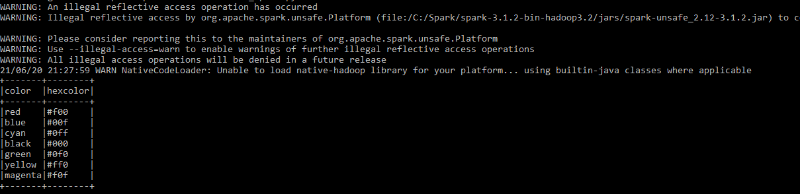

# Homework Spark Using PySpark

## Requirements
- Spark `https://phoenixnap.com/kb/install-spark-on-windows-10`
- Python version 3.7 or higher
- Java version 8 or higher

## How to Run
- copy file `data/spark-env.cmd` ke folder `conf` di dalam folder instalasi spark  
- jalankan program dengan `spark-submit homework_spark.py`

## Sample Output

